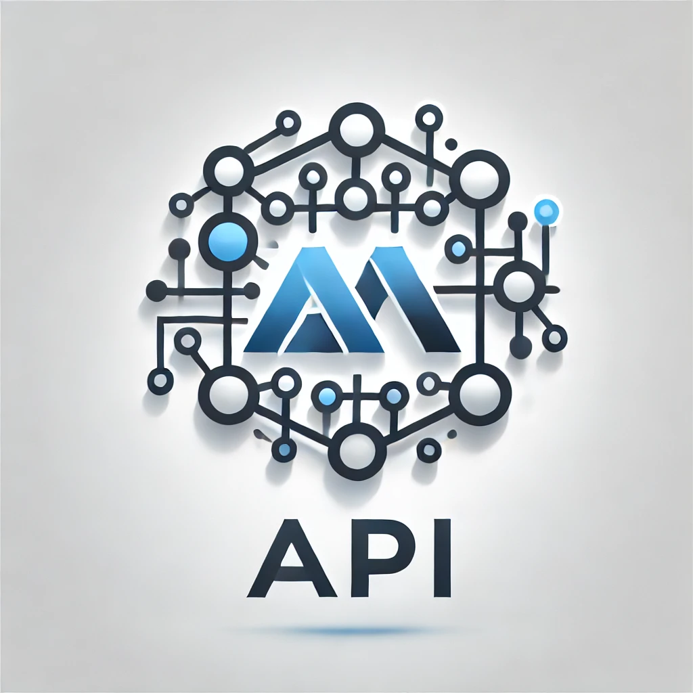

# Users API DoNet




The API is using C# as the programming language. This is because the .NET ecosystem, including the dotnet CLI, defaults to C# for most project templates, including the webapi template.


---

## Index

[🏠 1 Howto run locally](1-howto-run-locally)<br>
[☁️ 2 Howto deploy to Azure](2-howto-deploy-to-azure)<br>
[📖 3 API Documentation (Swagger)](3-API-Documentation-Swagger)<br>
[🛠️ 4 How I created the API](4-how-i-created-the-api)<br>
[📜 5 License](📜-5-license)<br>


---

## 🏠 1 Howto run locally

A. Install software:
* VS Code - https://code.visualstudio.com
* Git - https://git-scm.com/downloads
* DotNet - https://dotnet.microsoft.com/en-us/download
* Microsoft SQL Server (Developer) - https://www.microsoft.com/en-us/sql-server/sql-server-downloads

B. Clone the project

C. Run the project

* ```dotnet run```
* ...or...
* ```dotnet watch run```

---

## ☁️ 2 Howto deploy to Azure


---

## 3 📖 API Documentation (Swagger)


http://localhost:5248/swagger


---

## 🛠️ 4 How I created the API

New Web API:
```
dotnet new webapi -n users-api-donet
```

Added packages for Swagger Doc:
```
dotnet add package Swashbuckle.AspNetCore
```

## 📜 5 License

This project is licensed under the
[Apache License 2.0](https://www.apache.org/licenses/LICENSE-2.0).

```
Copyright 2024 github.com/ditlef9

Licensed under the Apache License, Version 2.0 (the "License");
you may not use this file except in compliance with the License.
You may obtain a copy of the License at

    http://www.apache.org/licenses/LICENSE-2.0

Unless required by applicable law or agreed to in writing, software
distributed under the License is distributed on an "AS IS" BASIS,
WITHOUT WARRANTIES OR CONDITIONS OF ANY KIND, either express or implied.
See the License for the specific language governing permissions and
limitations under the License.
```
